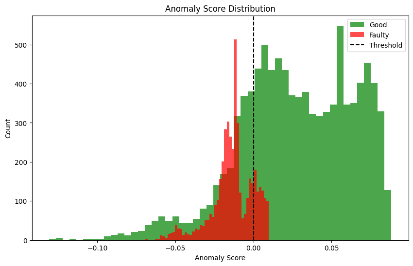
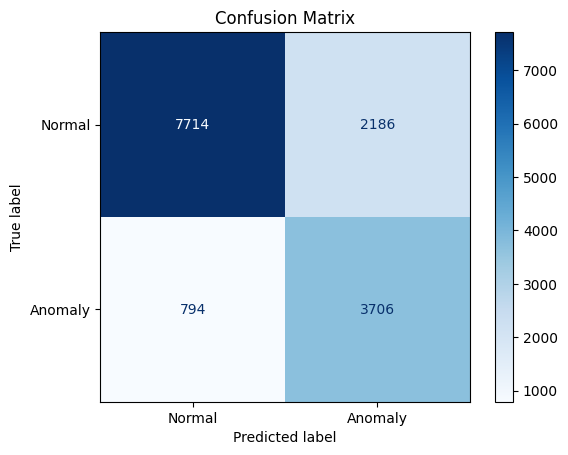

**DCRM Anomaly detection using Machine Learning**. 

*STATUS : Experimental / Reconstructed*

**⚠️ This repository is a reconstruction of the SIH 2025 project, and does not represent the submitted implementation.**
*This repository contains a reconstruction of the work I developed during the Smart India Hackathon 2025 Finals. It is not the final implementation and does not contain every component of the original system. Some parts have been rebuilt from the project material and my recollection of the original work.*

An experimental machine-learning approach to automated condition assessment of Extra-High Voltage (EHV) circuit breakers using DCRM test data.

**The Problem**

DCRM (Dynamic Contact Resistance Measurement) is a diagnostic test used to assess the condition of high-voltage circuit breakers.

A typical DCRM test produces waveform data describing characteristics such as:
Coil current
Contact travel
Dynamic contact resistance
Current
Opening/closing velocity
Bounce behaviour

These measurements can be difficult to analyse consistently because interpretation often depends on manual inspection and domain expertise.

The goal of this project was to explore whether machine learning could assist engineers in identifying abnormal circuit-breaker behaviour from DCRM measurements.

**What I Built**

Rather than requiring a large collection of explicitly labelled failure examples, the idea was to learn the distribution of normal/expected behaviour and identify observations that deviate significantly from it.

The main approach explored in this project was anomaly detection using Isolation Forest. 

Trained on a proprietary dataset provided by the M.O.P., the model is able to flag a significant amount of anomalies(expect some deviation though) and provides the user with metrics such as -
1. Status of the Circuit Breaker
2. Severity(in case of damages)
3. Anomaly Score
4. Anomaly percentage  
and several other statistics. 

The pipeline broadly consisted of:

DCRM Data -> Data Cleaning & Preprocessing -> Feature Extraction / Engineering -> Feature Scaling -> Isolation Forest -> Anomaly Score -> Condition Assessment

*The system was designed to provide information such as:*
>Circuit-breaker condition/status

>Anomaly score

>Anomaly percentage

>Severity indication

>Other diagnostic statistics

The model performance -

**Potential Features-**
1. 1-D CNN to be able to read and predict from waveform graphs. 
2. More accuracy and robustness with autoencoder(s).
3. Authentication.
4. Predictive maintainance information.
5. Enhanced Fault Isolation.

**Example features**
>Coil Current C1–C6

>Contact Travel T1–T6

>DCRM Resistance CH1–CH6

>DCRM Current CH1–CH6

>CH1–CH6 Close Velocity

>CH1–CH6 Open Velocity

>CH1–CH6 Test Run

>Resistance Break

>Bounce Break

>Phase

>Breaker ID

*The raw/proprietary dataset is not included in this repository.*

**This repository is not the final version of the project.**

Tech :
Python · Pandas · NumPy · SciPy · Scikit-learn · Joblib

Made with ❤️ by Ayushmaan Bhatnagar
